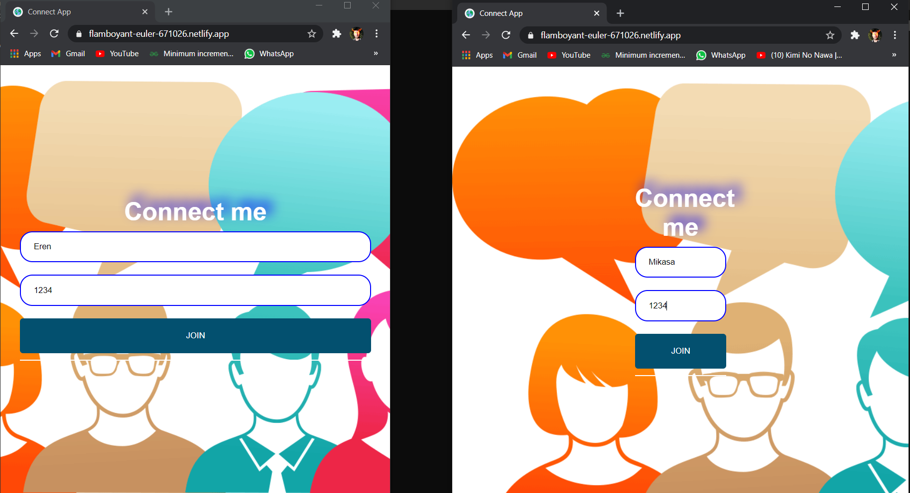
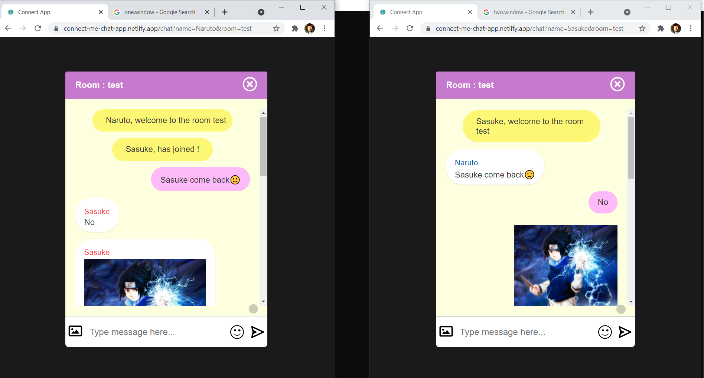

# chat-app


# [Live app link](https://connect-me-chat-app.netlify.app/)

A chat application where 2 or more users can chat in a given room
<u>Supported features implemented till now</u>
1. special message when someone join / leaves room
2. emoji dashboard

<br>


<br>

Setup :
 To run app
 ```
 1. npm install
 2. npm start 
 ```
 for both client and server in different terminal
 
 Built using ReactJS for frontend and nodeJS for backend and socket io library for handling websockets
