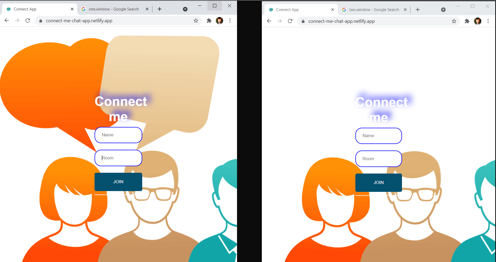

# chat-app


# [Live app link - https://connect-me-chat-app.netlify.app/](https://connect-me-chat-app.netlify.app/)

A chat application where 2 or more users can chat in a given room
<u>Supported features implemented till now</u>
1. special message when someone join / leaves room
2. emoji dashboard
3. images can be sent


<br>
<hr>
# Join

<hr>
# Chat ( images can also be sent )

<hr>
# Emoji dashboard

<br>

Setup :
 To run app
 ```
 1. npm install
 2. npm start 
 ```
 for both client and server in different terminal
 
 Built using ReactJS for frontend and nodeJS for backend and socket io library for handling websockets
